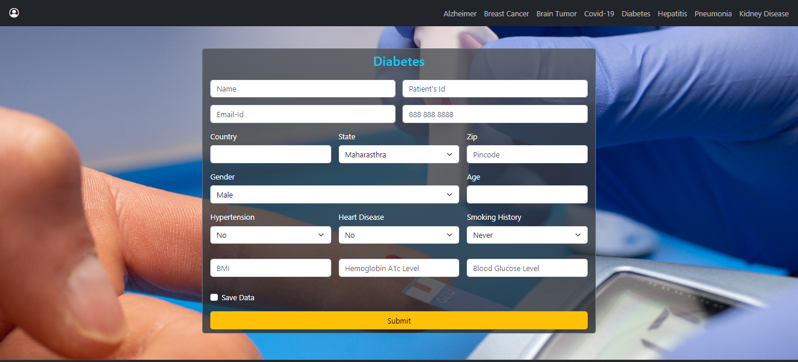
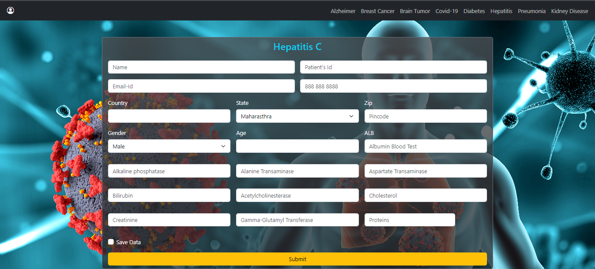

<h1 align="center">DeepCareX: AI-based Healthcare System</h1>

<h3 align="center">Sumon Singh</h3>
<h3 align="center">2023</h3>

---

## 📝 Table of Contents

- [Introduction](#intro)
- [Objective](#obj)
- [Literature Review](#LR)
- [Methodology and Implementation Details](#MID)
- [Algorithms Used For This Application](#Algo)
- [Experimentation Setup and Results](#Exp)
- [Use Cases](#cases)
- [User Interfaace (UI)](#ui)
- [Conclusion](#con)
- [References](#ref)

## **Introduction** 

Effective diagnosis of a disease is a significant need on a large scale. The development of a tool for early diagnosis and an efficient course of therapy is extremely difficult due to the complexity of the many disease mechanisms and underlying symptoms of the patient population. Some of these problems can be resolved by researchers, doctors, and patients thanks to machine learning (ML), a branch of artificial intelligence (AI).

Artificial intelligence (AI) in the medical field largely focuses on creating algorithms and methods to assess if a system's behavior in diagnosing diseases is accurate. The sickness or disorders that account for a person's symptoms and indicators are identified by a medical diagnosis.

## **Objectives** 

The objectives of this project is:

1. **Identify diseases by analyzing symptoms.**
   - Users need to input their required data according to the disease. This could be blood sugar levels, their x-ray scans, smoking history, and parameters as per the disease.

2. **Generate output based on these parameters.**
   - A person can also choose whether they wish to save their data or not.

3. **Use deep learning and machine learning models.**
   - Distinguish between symptoms that are similar but could be caused by different diseases. By taking into account a variety of symptoms and their combinations, this purpose is to give precise and targeted outcomes.

4. **Provide the user with the choice to save the data for further use.**

5. **Receive feedback from users.**
   - Provision of weekly newsletters and other healthcare information.

Some of the algorithms used in this project are XGBoost, Random Forest, Logistic Regression, CNN, etc.

- **XGBoost (Extreme Gradient Boosting)** is an optimized distributed gradient boosting library designed for fast and scalable model training. It is an ensemble learning technique that combines predictions of multiple weak models to get stronger predictions.
- **Random Forest** is a classifier that uses many decision trees on different subsets of the input dataset and averages the results to increase the dataset's predicted accuracy.
- **Convolutional Neural Networks (CNNs)** are a subclass of deep learning models. Convolutional and pooling layers are examples of specialized layers used by CNNs to automatically learn hierarchical patterns and features from the input data.

Average accuracy achieved throughout was above 90%.

## **Literature Review** 

In M. Swathy and K. Saruladha's paper [1], the classification, data mining, machine learning, and deep learning models used to predict cardiovascular illnesses are compared and reported. Some of the points they noticed were that a better model with greater accuracy and performance can be produced by using more medically relevant features. Also, combining data and text mining with the current models can create effective prediction systems. Swarm intelligence techniques and genetic algorithms can be used to focus more on the feature selection and input parameters, which will increase execution. They also observed that, for 15 attributes, the Multi-layered perceptron with back propagation gives better results as compared to others.

Based on the patient's clinical characteristics, the authors P. Rani et al. [2] suggest a hybrid decision support system that can help in the early detection of heart disease. To deal with the missing values, the authors employed the multivariate imputation by chained equations algorithms. The choice of appropriate features from the supplied dataset has been made using a hybridised feature selection approach that combines the Genetic approach (GA) and recursive feature elimination. SMOTE (Synthetic Minority Oversampling Technique) and common scalar approaches have also been employed for pre-processing the data. The authors used support vector machine, naive bayes, logistic regression, random forest, and adaboost classifiers in the final stage of creating the proposed hybrid system. With the random forest classifier, the system has been found to produce the most accurate results. The proposed hybrid system was put to the test in a Python-developed simulation environment. The system was tested on the Cleveland heart disease dataset available at UCI (University of California, Irvine) machine learning repository. It gave an accuracy of 86.6%.

S. Afzal, et al. [3] did a review study of Alzheimer's based on the classification of cognitive impairment and neuroimaging. This study offers a thorough analysis of the published research on AD, particularly computer-aided diagnosis. The imaging modalities are:
1. Magnetic resonance imaging (MRI)
2. fMRI, or functional MRI
3. Diffusion tensor imaging
4. Amyloid-PET
5. Positron emission tomography (PET)

According to the study, using a classification criterion based on features can better diagnose the condition and advance its clinical course. Support Vector Machine, Bayesian Classifiers, Linear Discriminant Analysis, K-Nearest Neighbour, and Deep Learning are some of the most often used machine learning classifiers for diagnosing AD.

P. Gokila Brinddha [4] applied ANN and CNN on MRI images of the brain to detect the presence of a brain tumour and analysed the performance. The ANN model gave a training accuracy of 97.13% and validation accuracy of 71.51% for 50 epochs. The testing accuracy achieved by the model was 65.21%. Meanwhile, the CNN model gave a testing accuracy of 89%.

Dheiver and Ewerton Santos [5] used MobileNetV2 to detect brain tumours. MobileNetV2 is a 53-layer deep CNN pre-trained model which is trained on almost a million images from the ImageNet database. It gave a validation accuracy of 89.24%.

In this study, M. Jyotiyana and N. Kesswani [6] used the National Alzheimer's Coordinating Centre (NACC) database to categorise patients with Alzheimer's disease using random forest (RF), support vector machine (SVM), K-nearest neighbour (KNN), linear discriminate analysis (LDA), and neural networks (NN). They also classified MRI data using a multi-layer perceptron (MLP), and the results showed that it was the most accurate method with 94% precision. MLP is able to handle large and complicated real-world data sets since it can operate on input variables simultaneously.

D. Yang, et al. [7] investigated several deep learning enhanced techniques and applied them to X-ray and CT scan images to detect COVID-19. Four pre-trained CNN models were used in this paper for classification of COVID-19. They are VGG16, DenseNet121, ResNet50, and ResNet152. They proposed a Fast.AIResNet Framework to automatically find the best training parameters, pre-process the data, and find the best architecture. The F1-score and accuracy for the diagnosis of COVID-19 using CT scan images were both over 96%. In order to overcome the difficulty of lack of data and reduce the training period, they also used transfer learning techniques. Enhanced VGG16 deep transfer learning architecture was used to complete the binary and multi-class classification of X-ray image tasks. The enhanced VGG16 detected COVID-19 with an accuracy score of 99%. Compared to other relevant approaches in their literature review, the suggested methods produce superior COVID-19 diagnostic outcomes.

By combining a DNN (deep neural network) model with two ML models for illness prediction using laboratory test data, D. Park, et al. [8] hoped to create a new, improved ensemble model. Based on value counts, clinical importance-related characteristics, and missing values, 86 attributes (laboratory tests) were chosen from datasets. On 5145 cases, they gathered sample datasets, which included 326,686 laboratory test results. Based on the International Classification of Disorders, 10th Revision (ICD-10) codes, they examined a total of 39 distinct disorders. These datasets were used to build DNN models using TensorFlow and the light gradient boosting machine (LightGBM) and extreme gradient boosting (XGBoost) ML models. For the five most prevalent illnesses, the optimised ensemble model had a prediction accuracy of 92% and an F1-score of 81%. The prediction abilities and patterns for the classification of diseases between the deep learning and ML models were different. Utilising a confusion matrix and the SHAP value method, they examined the significance of each feature. Through the classification of diseases, their new ML model successfully predicted diseases with a high degree of accuracy.

R. Keniya, et al. [9] created a system for predicting diseases using several ML algorithms. More than 230 diseases were present in the dataset that was processed. The diagnosis method outputs the ailment that a person may be suffering from based on the symptoms, age, and gender of the individual. In comparison to the other algorithms, the weighted KNN algorithm produced the best results. The weighted KNN algorithm gave a prediction accuracy of 93.5%.

K. Saxena, et al. [10] created a web application for non-transmissible diseases that can be easily used by someone with just a little medical training, making early disease prediction possible. Their system includes image capture, image preprocessing, segmentation, feature extraction, and classification of disease. If the associated disease parameters are correctly understood, the web application can identify many diseases, including cancer, diabetes, heart disease, liver disease, renal diseases, malaria, and pneumonia. They achieved an accuracy of 94% using their proposed Faster CNN.

S. K. Sarangi [11] proposed a deep learning framework to detect diseases which include the stages: The suggested framework's phases are as follows: 
1. Generating data for use in medicine
2. Utilising natural language processing to enhance unstructured data
3. Utilising deep learning to find patterns in massive datasets
4. Making medical decisions

Their proposed framework gave an average accuracy of 90.8%.

In the paper of D. Varshni, et al. [12] evaluate how well pre-trained CNN models perform as feature-extractors used in conjunction with various classifiers to identify abnormal and normal chest X-rays. They use analysis to choose the best CNN model for the job. According to statistical findings, pre-trained CNN models combined with supervised classifier algorithms can be highly helpful for analysing chest X-ray pictures, particularly when trying to find pneumonia. They assessed the performance of pre-trained CNN models including Xception, VGG16, VGG-19, ResNet-50, DenseNet-121, and DenseNet-169 followed by other classifiers like Random Forest, K-nearest neighbours, Naive Bayes, and Support Vector Machine (SVM). ResNet-50 CNN model with depth 168 with SVM classifier was shown to perform better than all other pre-trained CNN models, with an AUC score of 0.7749.

In the proposed work of D. Kumar G, et al. [13] used data pre-processing methods like removing noisy data, removing missing data and classification of attributes for prediction and decision making at various levels. In order to diagnose or raise awareness of heart disease, this research suggests a prediction model to determine whether a person has the condition or not. To present an appropriate model for predicting cardiovascular illness is done by comparing the accuracies of applying rules to the individual findings of Support Vector Machine, Gradient Boosting, Random forest, Naive Bayes classifier, and logistic regression on the dataset gathered in a region. Most of the algorithms gave good results, but logistic regression achieved the highest accuracy of 91.61%.

D. K. Rathore and P. K. Mannepalli [14] proposed a model for supervised classification experiment evaluation to assess how well the proposed method classified the data. The work was completed in a number of steps, starting with the uploading or importing of datasets, followed by data preprocessing to remove missing data or identify values, feature selection method application to extract data for disease identification, and finally the classification phase.

The study of R. Bharti, et al. [15] compares the findings and analysis of the UCI Machine Learning Heart Disease dataset using a variety of machine learning algorithms and deep learning techniques. The dataset has 14 key features that are needed to do the analysis. The dataset contains a few unimportant characteristics that are handled using Isolation Forest, and data is also normalised for improved results. Various promising findings are obtained and are confirmed using accuracy and confusion matrix. They used various approaches which included:
1. With feature selection and outlier detection
2. Without feature selection and outlier detection
3. Deep learning approach

94.2% accuracy was achieved using a deep learning method.

M. O. Edeh, et al. [16] constructed an AI-based ensemble model for predicting Hepatitis C illness in patients with the ability to predict advanced fibrosis by combining clinical data and blood biomarkers after studying several types of machine learning algorithms to build the classification models. A wide range of Hepatitis C disease-related parameters were included in the dataset. Three machine learning techniques were used on the training data set, and the verified data was then utilised to assess the ensemble learning-based prediction model. The findings showed that, in comparison to the prevailing machine learning methods, the suggested ensemble learning model has been found as being more accurate. The most accurate learning strategy was the Multi-layer Perceptron (MLP) method (94.1% accuracy). The second-most accurate learning algorithm was the Bayesian network (94.47% accuracy). The accuracy increased to a level of 95.59%. The study showed that employing an ensemble model rather than a single algorithm provides higher precision or accuracy in predicting Hepatitis C illness.

Here's the formatted version of your content in Markdown:

In this article, deep learning techniques for illness prediction are reviewed. Z. Yu, et al. [17] separated the algorithms into two categories: algorithms for structured data and algorithms for unstructured data. ANN and FM-Deep Learning algorithms are examples of structured data algorithms. Algorithms for unstructured data include CNN, RNN, etc. The theory, history of development, and use of these algorithms in illness prediction are explained in this study. Additionally, their review listed a number of issues with current disease research, including:
1. Poor capacity to interpret
2. Data inequality
3. Poor data quality
4. Insufficient data

Dr C. K. Gomathy [18] created a system that processed the symptoms that the user gives as inputs and gives the probability of disease as output. The prediction of the illness is done using the supervised machine learning method known as the Naive Bayes classifier. The Naive Bayes method determines the likelihood of the illness. They also forecasted illnesses like Diabetes, Malaria, Jaundice, Dengue, and Tuberculosis using linear regression and decision trees. Decision tree gave an accuracy of 84.5% and Naïve Bayes 89.4%. SVM gave an accuracy score of 96.49% while Random Forest gave the highest accuracy of 98.95%.

O. E. Santangelo's, et al. [19] study's objective is to demonstrate if machine learning can be used to anticipate infectious disease outbreaks in advance. The Cochrane Collaboration's recommendations for systematic reviews, meta-analyses of observational studies in epidemiology, and recommended reporting items were all followed in the conduct of this study. The research examined in this systematic review show that it is feasible to forecast the prevalence and development of various infectious illnesses; by integrating a number of machine learning methods and approaches, it is possible to get findings that are precise and tenable.

A. K. Dwivedi [20] realized that it was crucial to develop a framework that can quickly and accurately identify the prevalence of heart disease in hundreds of samples. Six machine learning approaches were tested at this point for their ability to predict cardiac disease. These algorithms' performance was evaluated using eight different classification performance metrics. Additionally, the receiver operating characteristic curve was used to evaluate these methods. With a sensitivity and specificity of 89 and 81%, respectively, logistic regression was shown to have the greatest classification accuracy of 85%.

## **Methodology and Implementation Details** 

The ability for a computer to automatically learn from data, enhance performance based on prior experiences, and make predictions is known as machine learning. A collection of algorithms used in machine learning operate on vast amounts of data. These algorithms are fed data to train them, and after training, they develop a model and carry out a certain task.

Machine learning is primarily split into four kinds based on the techniques and modes of learning, which are:

1. **Supervised Machine Learning**

   > Supervised machine learning, as its name indicates, is based on supervision. The "labelled" data is used to train the machines in the supervised learning approach, and after the training, the computer predicts the outcome. The primary objective of the supervised learning approach is to map the input (x) variable with the output (y). Risk assessment, fraud detection, spam filtering, and other practical uses of supervised learning include these. Problems with supervised machine learning may be divided into two categories, which are: Regression and Classification. In order to tackle classification issues when the output variable is categorical, classification algorithms are utilised. Regression problems with a linear relationship between the input and output variables are solved using regression techniques.

2. **Unsupervised Machine Learning**

   > Unsupervised learning differs from the supervised learning method in that no supervision is required. This indicates that in unsupervised machine learning, the computer is taught using the unlabelled dataset and makes output predictions without any human supervision. Unsupervised learning uses data that has neither been categorised nor labelled to train models, which then act on that data autonomously. The primary objective of the unsupervised learning method is to classify or group the unsorted dataset in accordance with the patterns, trends, and differences.
   >
   > Unsupervised categories for learning are clustering and association. When looking for the innate groups in the data, we use the clustering technique. It is a method of clustering the items such that those who have the most similarities stay in one group and share little to none in common with those in other groups. The unsupervised learning method called association rule learning identifies intriguing relationships between variables in a sizable dataset. This learning algorithm's primary goal is to identify the dependencies between data items and then map the variables in a way that maximises profit.

3. **Semi-Supervised Machine Learning**

   > Between supervised and unsupervised machine learning, there is a form of method known as semi-supervised learning. It employs a combination of labelled and unlabelled datasets during the training phase and stands in the middle of supervised learning (with labelled training data) and unsupervised learning (without labelled training data) techniques.

4. **Reinforcement Learning**

   > With reinforcement learning, an AI agent (a software component) automatically explores its surroundings by hitting and trailing, acting, learning from experiences, and improving performance. Reinforcement learning operates on a feedback-based process. The objective of a reinforcement learning agent is to maximise the rewards since the agent is rewarded for every good activity and penalised for every negative one. In contrast to supervised learning, reinforcement learning relies solely on the experiences of the agents.

## **Algorithms Used For This Application** 

Many techniques were used for data processing and various supervised algorithms were tested to predict the outcome, out of which the best one was used as the final model. Various methods for data cleaning were used, for example, filling the missing values with suitable values according to data. The categorical variables were converted to numeric using the One hot encoder and Label encoder features in Python's sklearn library. The following algorithms were used to predict the diseases.

### **1. Logistic Regression**

One of the most often used Machine Learning algorithms, within the category of Supervised Learning, is logistic regression. Using a predetermined set of independent variables, it is used to predict the categorical dependent variable.

In a categorical dependent variable, the output is predicted by logistic regression. As a result, the result must be a discrete or categorical value. Rather than providing the precise values of 0 and 1, it provides the probabilistic values that fall between 0 and 1. It can be either Yes or No, 0 or 1, true or false, etc.

Logistic regression fits an "S" shaped logistic function, which predicts two maximum values (0 or 1). The threshold value idea in logistic regression sets the likelihood of either 0 or 1. For instance, include values that incline to 1 over the threshold value and to 0 below it.

Based on the categories, there are three different types of logistic regression:

- **Binomial**: 0 or 1, Pass or Fail, etc., are the only two conceivable forms of dependent variables in a binomial logistic regression.
- **Multinomial**: In multinomial logistic regression, the dependent variable may be one of three or more potential unordered kinds.
- **Ordinal**: In ordinal logistic regression, the dependent variables can be categorised into one of three potentially ordered classes, such as "low," "Medium," or "High".

### **2. Decision Tree**

A supervised learning method called a decision tree can be used to solve classification and regression issues. It is a tree-structured classifier, where internal nodes represent a dataset's characteristics, branches for the decision-making process, and each leaf node for the classification result. The Decision Node and Leaf Node are the two nodes of a decision tree. While Leaf nodes are the results of decisions and do not have any additional branches, Decision nodes are used to make decisions and have multiple branches. The provided dataset's characteristics are used to execute the test or make the judgements. It is a graphical form for gathering all potential responses to a problem or decision based on conditions of data.

In a decision tree, the algorithm begins at the root node and works its way up to forecast the class of the provided dataset. This algorithm follows the branch and jumps to the following node by comparing the values of the root attribute with those of the actual dataset attribute. The algorithm compares the attribute value with the other sub-nodes once again for the following node before continuing. It keeps doing this until it reaches the tree's leaf node.

The fundamental problem that emerges while developing a decision tree is choosing the most suitable attribute for the root node and sub-nodes. So, an attribute selection measure, or ASM, can solve these issues. There are two widely used ASM approaches, which are Information Gain and Gini Index.

Following the segmentation of a dataset based on an attribute, information gain is the measurement of changes in entropy. It figures out how much knowledge a feature gives us about a class. We divide the node and create the decision tree based on the value of the information gained. Entropy is a metric used to evaluate the impurity of a certain property. It represents data randomness.

The CART (Classification and Regression Tree) technique uses the Gini index as a measure of impurity or purity while building decision trees. An attribute with a low Gini index is preferable to one with a high Gini index.

### **3. Random Forest**

The supervised learning method includes the well-known machine learning algorithm, Random Forest. It can be applied to ML Classification and Regression issues. Its foundation is the idea of ensemble learning, which is the process of integrating various classifiers to address a difficult issue and enhance the performance of the model. Random Forest uses a number of decision trees on different subsets of the input dataset and averages the results to increase the dataset's predicted accuracy. Instead of depending on a single decision tree, the random forest uses forecasts from all of the trees to anticipate the outcome based on which predictions received the most votes.

Higher accuracy can be achieved if the number of trees is increased.

### **4. XGBoost**

The Python XGBoost package implements gradient-boosted decision trees with a focus on speed and execution, which is the most crucial component of ML (machine learning). Gradient Boosting is an AI technique that is used, among other things, in classification and regression assignments. It presents a forecast model as a group of weak decision trees for forecasting.

#### Functioning of XGBoost:

- The loss function must be improved, which means making it smaller than the outcome.
- Weak learners get used in the model to set expectations.
- In this, decision trees are used in a manner, which refers to choosing the best-divided targets in light of Gini Impurity and other factors or to restrict the loss function.
- The loss function is constrained by combining all of the weak models using the additive model.
- Each tree is added, making sure that no already existing trees in the decision tree are modified. The ideal hyper bounds are regularly discovered using the angle plummet procedure, after which more loads are refreshed.

### **5. Support Vector Machines**

One of the most well-liked supervised learning algorithms, Support Vector Machine, or SVM, is used to solve Classification and Regression problems. However, it is primarily employed in Machine Learning Classification problems.

The SVM algorithm's objective is to establish the optimal line or decision boundary that divides n-dimensional space into classes, allowing us to quickly classify fresh data points in the future. A hyperplane is the name given to this optimal decision boundary.

SVM selects the extreme vectors and points which help in the creation of the hyperplane. Support vectors, which are used to represent these extreme instances, form the basis for the SVM method.

There are two types of SVM:

- **Linear SVM**: Linear SVM is applied for data that can be divided into two classes using a single straight line. This type of data is called linearly separable data, and the classifier employed is known as a Linear SVM classifier.
- **Non-linear SVM**: Non-Linear SVM is a method of classification for non-linearly separated data. If a dataset cannot be categorised using a straight line, it is considered non-linear data, and the classifier employed is referred to as a Non-linear SVM classifier.

### **6. Convolutional Neural Networks**

One of the primary categories used in neural networks for image recognition and classification is the convolutional neural network.

CNN accepts an image as input and categorises and processes it using terms like "dog," "cat," "lion," "tiger," etc. The resolution of the image affects how the computer interprets it as an array of pixels. It will perceive as h \* w \* d, where h = height, w = width, and d = dimension, depending on the image resolution. For instance, a grayscale image is a matrix array of 4 \* 4 \* 1, while an RGB image is a matrix array of 6 \* 6 \* 3.

Each input image in CNN is processed by a series of convolutional layers, pooling layers, fully connected layers, and filters (sometimes referred to as kernels). The first layer to extract features from an input image is the convolution layer. The convolutional layer maintains the link between pixels by learning visual properties using a tiny square of input data. Using an image matrix and a kernel or filter as two inputs, it performs a mathematical action. By adding filters, the convolution of an image can perform an operation such as blur, sharpen, and edge detection.

The pooling layer is crucial to the pre-processing of a picture. When the photos are too big, the pooling layer minimises the number of parameters. "Downscaling" the picture acquired from the prior layers is pooling. It is comparable to reducing the size of an image to lessen its pixel density. Downsampling or subsampling are other terms for spatial pooling, which minimises the dimensionality of each map while keeping the crucial data. The input from the other levels will be flattened into a vector and transmitted to the fully connected layer. The output will be changed by the network into the desired number of classes.

The input from the other levels will be flattened into a vector and transmitted to the fully linked layer. The output will be changed by the network into the desired number of classes. To categorise the outputs as a vehicle, dog, truck, etc., the characteristics to build a model will be aggregated and then an activation function, such as softmax or sigmoid will be applied.

#### In this project, a simple CNN network was used to predict the outcome for two diseases.

**The summary of the model for predicting Alzheimer's is:**

**The summary of the model used to predict the outcome of Kidney disorder is:**

## **7. Transfer Learning Models**

Transfer learning is a machine learning research subject that is concerned with the storage of information obtained while resolving one problem and its subsequent application to another, related problem. Transfer learning is the ability to retain the knowledge gained from addressing one problem and apply it to a different one later on. With transfer learning, models are created utilising prior knowledge that demonstrates greater effectiveness and learns more quickly with less training data. The nicest thing about transfer learning is that just a portion of the trained model has to be learned in order to use it. Transfer learning helps us do this while saving time.

### **DenseNet201**

The Dense Convolutional Network (DenseNet) feeds forward connections between every layer. They reduce the number of parameters significantly, enhance feature propagation, increase feature reuse, and solve the vanishing-gradient problem.

> DenseNet is based on the premise that convolutional networks may be trained to be significantly deeper, more precise, and more effective if the connections between the layers near the input and the layers near the output are shorter. DenseNet-201 is 201 layers deep. The ImageNet database contains a pretrained version of the network that has been trained on more than a million images. The pretrained network can categorise photos into 1000 different item categories, including several animals, a keyboard, a mouse, and a pencil.
>
> DenseNet201 was used to predict the outcome for disease Pneumonia. The summary is given below:
>
> 
>
> 

### **ResNet152V2**

Residual Neural Network (ResNet152V2) is a convolutional neural network with 152 layers in it. ResNet employs skip connections to fit the output from one layer to the next in order to address the issue of disappearing gradients. There are numerous convolutional layers and max pooling layers in this pretrained model.

> ResNet152V2 was used to predict the outcome of COVID-19. The summary of the model is:
>
> 
>
> 

### **VGG19**

The Visual Geometry Group (VGG) at the University of Oxford created the convolutional neural network architecture known as VGG19. It is a deep learning model with 19 layers, 16 of which are convolutional and 3 of which are fully connected.

> The over-a-million-image ImageNet dataset served as the training set for VGG19, which is a model for image classification tasks. Small (3x3) convolutional filters are used across the whole network to create the architecture, which results in a highly deep but uniformly basic and straightforward design. Following the convolutional layers are the max-pooling layers, which lower the feature maps' spatial resolution and boost their translational resilience.
>
> To detect Brain Tumour VGG19 was used.
>
> 
>
> 

These algorithms were used to make the appropriate predictions for the diseases.

## **Experimentation Setup and Results** 

Using HTML, Bootstrap, and Flask, eight webpages were created for the diseases. Bootstrap offers a selection of JavaScript, CSS, and HTML building blocks that may be used to create web interfaces. Python-based Flask is a compact and adaptable web framework. It is made to be straightforward, simple to use, and offers the necessities for web development. Flask is adaptable and compatible with multiple hosting settings since it adheres to the WSGI (Web Server Gateway Interface) protocol and may operate on different web servers.

Also, a sqlite3 database is added to store the information of the user.

### **A. Tools Used:**

- **IDE:** Vscode, Jupyter Notebook
- **Platform:** Anaconda
- **Browser:** Microsoft Edge, Google browser (Tested On)
- **Languages:** Python 3.9, HTML, CSS
- **Framework:** Bootstrap v5.3.0-alpha, Tensorflow 2.9, Keras, Flask
- **Database:** sqlite3
- **Libraries:**
  1. numpy
  2. pandas
  3. scikit-learn
  4. matplotlib
  5. os
  6. scipy
  7. seaborn
  8. xgboost
  9. joblib
  10. pickle

### **B. Datasets and Sources:**

1. **For Alzheimer's:** Augmented Alzheimer MRI Dataset V2 <https://www.kaggle.com/datasets/uraninjo/augmented-alzheimer-mri-dataset-v2>
2. **For Brain Tumor:** Brain Tumor MRI Dataset <https://www.kaggle.com/datasets/masoudnickparvar/brain-tumor-mri-dataset>
3. **For Breast Cancer:** Breast Cancer Prediction Dataset <https://www.kaggle.com/datasets/merishnasuwal/breast-cancer-prediction-dataset>
4. **For Covid-19:** COVID 19 XRay and CT Scan Image <https://www.kaggle.com/datasets/ssarkar445/covid-19-xray-and-ct-scan-image-dataset>
5. **For Diabetes:** Diabetes prediction dataset <https://www.kaggle.com/datasets/iammustafatz/diabetes-prediction-dataset?resource=download>
6. **For Hepatitis C:** Hepatitis C Prediction Dataset <https://www.kaggle.com/datasets/fedesoriano/hepatitis-c-dataset>
7. **For Kidney Disease:** CT KIDNEY DATASET: Normal-Cyst-Tumor and Stone <https://www.kaggle.com/datasets/nazmul0087/ct-kidney-dataset-normal-cyst-tumor-and-stone>
8. **For Pneumonia:** Chest X-Ray Images (Pneumonia) <https://www.kaggle.com/datasets/paultimothymooney/chest-xray-pneumonia>

### **C. Features of Project**

1. Home page with Register/Log-in.
2. Individual pages for each of the 8 diseases. The user can input the symptoms and get the result as required.
3. On these pages, there is an option to save one's data. This data will then be stored in the database.
4. The result report will be displayed on the output page.
5. About Us page -- where information is provided about this system.
6. Contact Us page -- To send queries.

### **D. Directory Tree**

**DeepCareX - (ROOT)**

1. **Datasets** -- Consists of 8 datasets of diseases.
2. **Model_Code** -- Python codes for model generation of 8 diseases.
3. **Models** -- Saved deep learning and machine learning models in '.hdf', '.h5', and '.pkl' format.
4. **The frontend of the project consists of:**
   - **database:**
     1. Consists of a python script to create databases and its table.
     2. Consists of the sqlite3 database.
     3. A folder named "Uploaded" which saves all the images uploaded via frontend.
   - **static:**
     1. Images: consists of images which have been used for the frontend design.
     2. bootstrap-5.3.0-alpha3-dist: Installed bootstrap.
     3. bootstrap-icons-1.10.5: Installed bootstrap icon.
     4. jquery: consists of jquery-3.6.4.min.js script.
     5. popper: consists of popper.min.js.
   - **templates:** Consists of all the HTML files for frontend.
   - **main.py:** It's the main python script to run the application, designed using the Flask framework.

### **E. Instructions to Run:**

#### Run The Application:

1. **Create the databases:**
   - Navigate to: `DeepCareX/Website/database`
   - Run: `database.py`
   - Syntax: `python3 database.py`

2. **Run The Application:**
   - Navigate to: `DeepCareX/Website`
   - Run: `main.py`
   - Syntax: `python3 main.py`

### The algorithms gave us good results. We will now go through the evaluation metrics obtained for each disease.

### I. **Breast Cancer**

> The Random Forest algorithm was used to determine if a person had breast cancer. GridSearchCV was used to determine the best number of estimators and depth for the model. Using this, we chose max depth as 90 and the number of estimators as 500. The metrics used to evaluate the model's performance were Precision, Recall, F1 score, and Accuracy. The model gave a validation accuracy of 0.94, precision score of 0.94, recall of 0.94, and f1 score of 0.94.
>
> The training evaluation metrics are:
>
> 
>
> The validation metrics are as follows:
>
> 

### II. **Diabetes**

> XGBoost Classifier was used to predict if a user had Diabetes. The model gave a validation accuracy of 0.97. Precision, recall, and f1 score were also 0.97.
>
> The evaluation metrics on training data were:
>
> 
>
> The validation metrics observed are:
>
> 

### III. **Heart Disease**

> To determine if a user is suffering from heart disease, Random Forest Classifier was used. The training metrics for the model are:
>
> 
>
> The validation metrics are:
>
> 

### IV. **Brain Tumour**

> Here VGG19 was used. The model gave a training accuracy of 0.98 and validation accuracy of 0.97.
>
> The graphical representation of change in accuracy and loss with the epochs is given below.
>
> 
>
> 

### V. **COVID-19**

> ResNet152V2 was used to determine COVID-19. The model gave a training accuracy of 0.98 and validation accuracy of 0.95.
>
> The accuracy plot and loss plot are given below:
>
> 
>
> 

### VI. **Alzheimer's**

> To predict Alzheimer's, a Vanilla CNN network was created, the summary of which is mentioned in the Convolution Neural Network section.
>
> The model gave a training accuracy of 0.97 and validation accuracy of 0.98.
>
> The accuracy and loss are illustrated below:
>
> 
>
> 

### VII. **Kidney Disorder**

> To predict kidney disorder, a CNN network was created. The model gave a 0.99 training accuracy and 0.97 validation accuracy.
>
> The accuracy and loss graphs are:
>
> 
>
> 

### VIII. **Pneumonia**

> DenseNet201 was used here and it gave a training accuracy of 0.98 and validation accuracy of 0.83. The accuracy and loss illustrations are given below:
>
> 
>
> 

## **Use Cases** 

The employment of these technologies can produce quick results within minutes, although real-life diagnosis might frequently take hours or even days. When given a set of symptoms, a trained model can quickly process and analyse the data, utilising its capacity to identify intricate patterns and make predictions based on learnt patterns from enormous amounts of data.

Machine and deep learning-based diagnostics' time-saving feature is especially helpful in emergency situations, where prompt decision-making is essential for giving prompt treatment. The possibility of saving lives and reducing the danger of illness development is increased by rapid diagnosis, which enables prompt therapies.

Additionally, the capacity to store symptom information and associated diagnoses from various individuals might be extremely beneficial for research. By combining this data, it is possible to analyse patterns and trends on a broader scale and find correlations, risk factors, and fresh perspectives on various diseases. These datasets can be used by researchers to increase understanding, create more precise models, and boost medical research and healthcare procedures.

## **User Interface (UI)** 

### Home page:

### About Us

### Contact

### Login

### After Registration/Login

#### Alzheimer's

#### Breast Cancer

#### Brain Tumor

#### Covid-19

#### Diabetes

#### Hepatitis C

#### Pneumonia

#### Kidney Disease

### Result for Kidney Disease

## **Conclusion** 

With the use of machine learning models, which are employed in the project to forecast the disease based on input provided by the user as a content of symptoms which are picked from a specified list of symptoms provided to the user, the predicted outcome is presented. The projected consequence observed will also have a user interface (UI), making it simpler for a user to operate and forecast the disease based on information given and making the process easier to complete.

In conclusion, using machine learning and deep learning methods for illness prediction has demonstrated enormous potential for enhancing patient outcomes. These algorithms may accurately detect early indicators and forecast the chance of acquiring particular diseases through the analysis of vast datasets and the extraction of relevant patterns.

Researchers and medical professionals have been able to predict diseases with great accuracy by using machine learning algorithms like decision trees, random forests, support vector machines, and convolutional neural networks (CNNs). To produce insightful analyses and individualised forecasts, these models may analyse a variety of data types, including medical records, genetic data, lifestyle factors, and environmental data.

Using deep learning and machine learning to forecast diseases has several advantages. The first benefit is that it makes it possible for preventive healthcare interventions, allowing for early diagnosis and treatment, possibly improving patient outcomes, and lowering healthcare expenditures. Identifying high-risk people or communities also helps with resource allocation by enabling focused treatments and preventative actions.

It's crucial to remember that illness prediction models have some drawbacks. They rely significantly on the representativeness and quality of the training data, which can create biases and affect prediction accuracy. Furthermore, these models might be difficult to interpret, making it tough for medical experts to comprehend the logic behind a given forecast.

## **Future Work**

There is a lot of room for improvement and growth with this project. The system may be made even more complete and beneficial for users by adding further functions. Here are some ideas about how to make the project better:

### **Expanded Disease Database**

You can think about growing the illness database to offer a more comprehensive diagnosing capability. To cover a wider variety of medical issues, do more research and add more disorders. Users will be able to get early diagnosis and intervention for a variety of health concerns because of this.

### **Integration with Healthcare Professionals**

It would be really helpful to implement a function that links users with nearby medical professionals or consultants who are experts in the ailment that has been identified. The technology can enable smooth communication and appointments with healthcare providers by using location-based services and collaborating with physicians and hospitals. Users would obtain prompt and individualised medical care because of this connectivity.

### **Advanced Predictive Models**

It is critical to continuously enhance the machine learning models used for illness prediction. Investigate more cutting-edge algorithms and methods, such as ensemble models, deep learning, or reinforcement learning, to create prediction models that are more reliable and precise. As a result, the system's diagnoses will be more accurate and reliable, improving user effectiveness.

### **Complete Diagnostic Reports**

Consider adding extra output or report sections to provide consumers more in-depth information about the diagnosis rather than just offering simple result labels. Include further information, such as the causes of the diagnosis, danger factors, suggested cures, and safety precautions. Users will have more knowledge of their health issues as a result, which will help them take the right steps.

### **Accessibility and User-Friendly Design**

Ensure that the application's interface is simple and easy to use. To reach a larger user base, make sure the system is usable on a variety of platforms and devices, including mobile ones. Include elements like custom user profiles, monitoring of medical history, and alerts for scheduled appointments or medicines.

### **Data Security and Privacy**

Give data privacy and security top priority because the project will be working with sensitive health information. Implement strong security measures, maintaining data protection laws, and following confidentiality requirements to secure user data.

The project can develop into a complete and trustworthy health prediction and diagnosis system by putting these improvements into place. Users will be given the information they need to make wise decisions about their health, it will link them together with qualified healthcare professionals, and it will help with illness early detection and prevention.

## **References** 

\[1\]. M. Swathy and K. Saruladha, "Comparative study of classification and prediction of Cardio-Vascular Diseases (CVD) using Machine Learning and Deep Learning techniques", ICT Express 8 (2022) 109--116, Science Direct, 2022.

\[2\]. P. Rani, R Kumar, N. M. O. S. Ahmed, A. Jain, "A decision support system for heart disease prediction based upon machine learning", Journal of Reliable Intelligent Environments, Springer Nature Switzerland AG 2021.

\[3\]. S. Afzal, M. Maqsood, U. Khan, I. Mehmood, H. Nawaz, F. Aadil, O. Young Song, Y. Nam, "Alzheimer Disease Detection Techniques and Methods: A Review", International Journal of Interactive Multimedia and Artificial Intelligence, Vol. 6, Nº7, 2022.

\[4\]. P. G. Brindha, M Kavinraj, P. Manivasakam, P. Prasanth, "Brain tumor detection from MRI images using deep learning Techniques", 2021 IOP Conf. Ser.: Mater. Sci. Eng. 1055 012115.

\[5\]. Dheiver Santos and Ewerton Santos, "Brain Tumor Detection Using Deep Learning", 1BRIDGE -- Instituto de Tecnologia e Pesquisa, Estado / UF: Sergipe / SE Município: Aracaju Bairro: Getúlio Vargas Logradouro: Rua São Cristóvão Número: 1361 Complemento: CEP: 49.055-620.

\[6\]. M. Jyotiyana and N. Kesswani, "Classification and prediction of Alzheimer's disease using multi-layer perceptron", Int. J. Reasoning-based Intelligent Systems, Vol. 12, No. 4, 2020.

\[7\]. D. Yang, C. Martinez, L. Visuña, H. Khandhar, C. Bhatt & J. Carretero, "Detection and analysis of COVID‑19 in medical images using deep learning techniques", Scientific Reports, Nature Portfolio, (2021) 11:19638.

\[8\]. D. Park, M. Park, H. Lee, Y. Kim, Y. Kim & Y. Hoon Park, "Development of machine learning model for diagnostic disease prediction based on laboratory tests", Scientific Reports, Nature Portfolio, (2021) 11:7567.

\[9\]. R. Keniya, A. Khakharia, V. Shah, V. Gada, R. Manjalkar, T. Thaker, M. Warang, N. Mehendale, "Disease prediction from various symptoms using machine learning", SSRN.

\[10\]. Ms. K. Saxena, R. Sharma, R. Kumar, R. Kumar, "Disease Prediction Using Machine Learning and Deep Learning", International Journal for Research in Applied Science & Engineering Technology (IJRASET) ISSN: 2321-9653; IC Value: 45.98; SJ Impact Factor: 7.538 Volume 10 Issue V May 2022.

\[11\]. S. K. Sarangi, Pallamravi, Pallamravi, N. R. Das, N. B. Madhavi, Naveen P, K. Kumar, "Disease Prediction Using Novel Deep Learning Mechanisms", Journal of Pharmaceutical Negative Results, Volume 13, Special Issue 9, 2022.

\[12\]. D. Varshini, K. Thakral, L. Agarwal, R. Nihjhawan, A. Mittal, "Pneumonia Detection Using CNN based Feature Extraction", Computer Science, Medicine 2019 IEEE International Conference on Electrical, Computer and Communication Technologies (ICECCT), 2019.

\[13\]. D. Kumar G, S. Kumar G, Arumugaraj K, Mareeswari V, "Prediction of Cardiovascular Disease Using Machine Learning Algorithms", IEEE International Conference on Current Trends toward Converging Technologies, 2018.

\[14\]. D. K. Rathore and P. K. Mannepalli, "Diseases prediction and classification using machine learning techniques", AIP Conference Proceedings 2424, 070001 (2022).

\[15\]. R. Bharti, A. Khamparia, M. Shabaz, G. Dhiman, S. Pande, and P. Singh, "Prediction of Heart Disease Using a Combination of Machine Learning and Deep Learning", Computational Intelligence and Neuroscience Volume 2021, Article ID 8387680.

\[16\]. M. O. Eden et al., "Artificial Intelligence-Based Ensemble Learning Model for Prediction of Hepatitis C Disease", Frontiers in Public Health, April 2022, Volume 10, Article 892371.

\[17\]. Z. Yu, et al., "Popular deep learning algorithms for disease prediction: a review", Cluster Computing (2023) 26:1231--1251, Springer.

\[18\]. Dr C K Gomathy, Mr. A. R. Naidu, "The Prediction of disease using Machine Learning", International Journal of Scientific Research in Engineering and Management (IJSREM) ,Volume: 05 Issue:10,Oct -- 2021.

\[19\]. Santangelo, O.E.; Gentile, V.; Pizzo, S.; Giordano, D.; Cedrone, F. "Machine Learning and Prediction of Infectious Diseases: A Systematic Review". Mach. Learn. Knowl. Extr. 2023, 5, 175--198.
